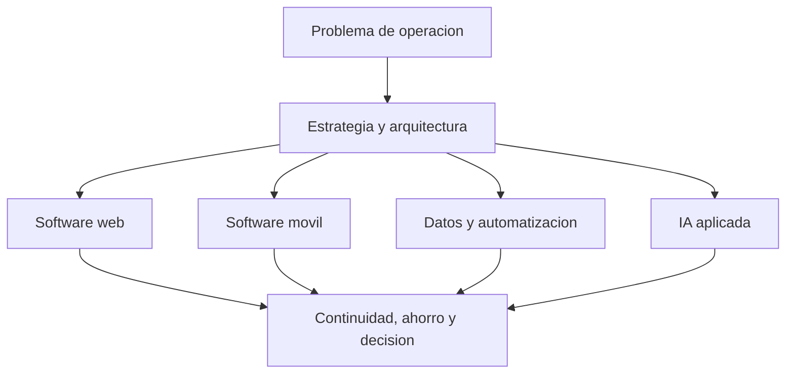

<h1 align="center">David Herrera</h1>
<h3 align="center">Gerente de Tecnologías de la Información</h3>

  Software empresarial, datos e inteligencia artificial aplicada al negocio. 
  Quito, Ecuador

  <a href="https://orcid.org/0000-0003-4507-0400">ORCID</a>
  &nbsp;·&nbsp;
  <a href="mailto:david.herrera1@live.com">david.herrera1@live.com</a>
  &nbsp;·&nbsp;
  <a href="https://github.com/david1997herrera">GitHub</a>

  
  
  
  
  
  
  

---

Diseño y pongo en operación sistemas que una empresa usa todos los días: aplicaciones web, software móvil de campo, automatización de datos y modelos aplicados a la producción. Desde 2022 dirijo la tecnología de **Tessa Corp**, con gobierno de TI, nube y desarrollo interno alineados al resultado del negocio.

## Resultados que sostengo

| Resultado | Efecto |
| --- | --- |
| Nube en AWS | 25% menos costo operativo |
| Automatización de procesos | 137 horas al mes recuperadas |
| Incidentes críticos | 40% menos |
| ETL en Python | 60% menos tiempo de procesamiento |
| Modelos de pronóstico | 30% más precisión |

Esos números salen de la gestión en Tessa Corp y del trabajo de analítica en Incubandina. La tecnología entra cuando cambia la operación, no cuando decora una presentación.

## Qué construyo

**Software empresarial.** Gestión documental con roles, tareas y seguimiento; control de activos con código QR; facturación electrónica alineada al SRI. Backend en Python, datos en PostgreSQL o SQL Server, entrega con Docker.

**Datos y decisión.** Tableros ejecutivos en Power BI, pipelines ETL y modelos de pronóstico para producción. El objetivo es que gerencia decida con una cifra defendible.

**Campo y móvil.** Aplicaciones Flutter para estaciones de trabajo y recorridos, donde el celular es el puesto de operación y no un accesorio.

**Inteligencia artificial aplicada.** Clasificación de imágenes y vehículos aéreos no tripulados para estimar el estado de rosas Explorer, y modelos SVM sobre datos de producción en agricultura de precisión.

## Trabajo público

**[Gestión documental](https://github.com/david1997herrera/APP_WEB_GESTION_DOCUMENTAL-).** Aplicación web para documentos y tareas por área. Flask, PostgreSQL y Docker. Roles de administración, escritura y lectura; avance medido por los archivos que el equipo realmente entrega.

**[Nimbol Jiu Jitsu](https://github.com/david1997herrera/nimbol-jiu-jitsu).** Operación de una academia: estudiantes, mensualidades, comprobantes y vencimientos. Flask y un tablero distinto para administración y para el alumno.

Otras líneas —activos, facturación electrónica, mercado inmobiliario, agritech— viven en repositorios privados de clientes y de operación.

## Trayectoria

**Tessa Corp** — Jefe de Tecnologías de la Información · agosto 2022 a la fecha  
Estrategia de TI del grupo, continuidad de ERP e infraestructura, evaluación de ERP, gobierno con COBIT y desarrollo de soluciones web y móviles.

**Universidad Internacional del Ecuador** — Docente tutor, Maestría en Ciencia de Datos e IA · 2025  
Tutoría en ciencia de datos, aprendizaje automático e inteligencia artificial aplicada.

**Incubandina** — Analista senior de BI y estadística · 2024 a 2025  
Tableros de producción, aplicaciones Python y JavaScript, y modelos predictivos para la planificación.

## Formación

- PhD en Ciencias Computacionales — Universidad Politécnica Salesiana, en curso
- Magíster en Gestión de Sistemas y Tecnologías de la Información — Universidad Bolivariana del Ecuador, en curso
- Magíster en Ciencia de Datos e Inteligencia Artificial — Universidad Internacional del Ecuador
- Magíster en Diseño Industrial y Procesos — Universidad Tecnológica Indoamérica
- Ingeniero Industrial en Procesos de Automatización — Universidad Técnica de Ambato

Green Belt Six Sigma (USFQ) · Diplomado en Data Science (PUCE) · CSWA SolidWorks (Dassault)

## Investigación

- *Combining Image Classification and Unmanned Aerial Vehicles to Estimate the State of Explorer Roses*
- *Optimizing Explorer Rose Production Data with SVM in Smart Agriculture*

Identificador de investigador: [0000-0003-4507-0400](https://orcid.org/0000-0003-4507-0400)

## Cómo colaboro

Entro cuando hace falta alguien que traduzca un proceso real a software operable: alcance, datos, roles, despliegue y el número que la gerencia va a mirar el lunes.

Si el problema es de operación, de datos o de un producto que tiene que quedar en manos del usuario, escríbame a [david.herrera1@live.com](mailto:david.herrera1@live.com).
